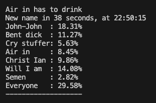

# Drikkespill Script

Dette scriptet er et drikkespill som tilfeldig velger en "taper" fra en liste med navn, annonserer hvem som må drikke, og viser en nedtelling til neste valg. Hvert navn har en vekt som øker sjansene for at de blir valgt igjen, men det justeres også med en reduksjonsfaktor for å balansere spillet.

Brukes til inndrikking av nye medlemmer i webkomiteen til Linjeforeningen Hybrida.

## Krav

### Python-pakker
- `numpy`
- `pyttsx3`

Du kan installere pakkene ved å kjøre følgende kommando:
```bash
pip install numpy pyttsx3
```

### Systemkrav

-   Python 3.x
-   En fungerende TTS-motor (Text-to-Speech) for `pyttsx3` (den bruker standard TTS-motorer installert på systemet ditt).

Hvordan bruke
-------------

1.  **Konfigurer navnelisten**: Du kan endre navnene i `names`-listen for å tilpasse spillet til dine venner.

    `names = ['John-John', 'Bent dick', 'Cry stuffer', 'Air in', 'Christ Ian', 'Will I am', 'Semen', 'Everyone']`

    Hvis noen navn skal ha høyere sannsynlighet for å bli valgt, kan du legge dem til i `extra_names`:

    `extra_names = ['Everyone']`

2.  **Start scriptet**: Kjør scriptet med Python. Scriptet vil:

    -   Velge et navn tilfeldig basert på vekter.
    -   Kunngjøre hvem som må drikke ved hjelp av tale og tekstutskrift.
    -   Justere vekt for navnene etter hver runde slik at spillet forblir balansert.
    -   Fortsette å kjøre med tilfeldige tidsintervaller mellom 10 og 60 sekunder.
3.  **TTS-innstillinger**: Scriptet er satt opp for å bruke `Microsoft Zira Desktop - English (United States)`som standard stemme. Du kan justere dette selv i koden.

4.  **Kjøring av spillet**: Når du starter scriptet, vil det begynne å kunngjøre taperen hvert tilfeldige tidsintervall. Scriptet stopper ikke automatisk, så det må avsluttes manuelt (Ctrl + C) når du vil stoppe det.

5.  **Tilpasning av tid**: Du kan justere minimum og maksimum tid mellom hver runde ved å endre verdiene for `min_time` og `max_time`:

    `min_time = 10  # Minimum tid i sekunder mellom hver runde
    max_time = 60  # Maksimum tid i sekunder mellom hver runde`

Eksempel på bruk
----------------

Når scriptet kjører, vil det annonsere taperen slik:


Stemmen vil også kunngjøre taperen høyt.

Tilpasninger
------------

-   **Navn og vekter**: Du kan tilpasse spillet med navnene til deltakerne og eventuelt justere vektfaktorer for enkelte personer.
-   **Stemmespråk**: Endre hvilken TTS-stemme som brukes ved å justere delen av koden som konfigurerer TTS-motoren.